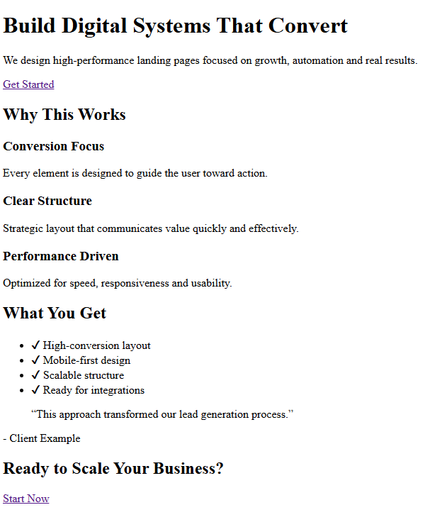

<div align="center">

# High Conversion Landing Page

### Conversion-driven web system for lead generation and business growth

<br>

Designing and implementing landing pages focused on performance, user experience and measurable results.

</div>

---

##  Overview

This project demonstrates the structure and strategy behind a **high-conversion landing page**, combining:

* UX/UI best practices
* Conversion-oriented layout
* Strategic content positioning
* Performance optimization

---

##  Objective

To build a landing page capable of:

* Generating qualified leads
* Maximizing conversion rates
* Communicating value clearly and effectively

---

##  Strategy

The page is structured based on proven conversion principles:

* **Clear value proposition above the fold**
* **Visual hierarchy and guided user flow**
* **Trust elements (social proof, credibility signals)**
* **Strong call-to-action (CTA) placement**
* **Minimal friction in user interaction**

---

##  Structure

```plaintext
/
├── index.html
├── assets/
│     ├── images/
│     ├── icons/
│
├── sections/
│     ├── hero/
│     ├── features/
│     ├── benefits/
│     ├── testimonials/
│     ├── cta/
│
├── styles/
├── scripts/
└── README.md
```

---

##  Technologies

* HTML5
* CSS3
* JavaScript
* Responsive Design Principles

---

##  Performance Focus

* Fast loading time
* Mobile-first approach
* Optimized assets
* Clean and scalable structure

---

##  Real-World Application

This type of system can be used for:

* Lead generation campaigns
* Product or service promotion
* Marketing funnels
* Business validation pages

---

##  Integration Possibilities

* CRM systems
* Email marketing platforms
* Analytics tools
* API integrations

---
## 📸 Preview


---

##  Contact

Interested in implementing a similar system?

* LinkedIn: [(meu LinkedIn)](https://www.linkedin.com/in/valdevino-neto-845757/)

---
